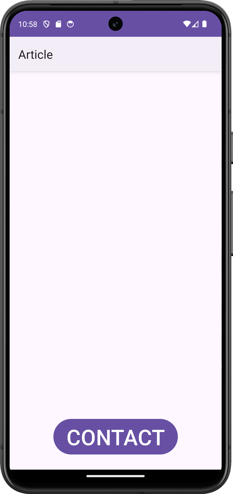

# Multiples activités et navigation

## Contenu

Démo d'un startActivity.

<Row>

<Column>

:::danger Avant la séance (2h)

- Regarder les vidéos
- Commencer les exercices . Arrête quand tu as complété tes 2 heures.

:::

</Column>

<Column>

:::tip Vidéos

<Video url="https://youtu.be/MOF0kb0ampc" />

<Video url="https://youtu.be/t4jYehSpR1A" />

<Video url="https://youtu.be/qvty1jwEj-4" />

<Video url="https://youtu.be/Zu2pd6vOxMM" />

:::

</Column>

<Column>

:::info À faire pendant la séance

Vous devez compléter les exercices de la semaine.

Vous travaillerez sur le **[travail 2](../tp/tp2)**.

:::

</Column>

</Row>

:::note Exercices

### Exercice Navigation

Tu dois implémenter une application avec trois activités. Voici la navigation souhaitée :

```mermaid
graph TD;
    Accueil-->Contact;
    Accueil-->Article;
    Article-->Contact;
    Contact-->Accueil;
```

- Les boutons doivent être au même endroit que sur les images. Ex : centré, en bas et centré, etc.
- Pour afficher un ActionBar simple, vous pouvez vous référer à cette [recette](../03-recettes/action-bar-simple.mdx).

<Row>

<Column>

</Column>

<Column>

</Column>

<Column>

</Column>

</Row>

### Exercice Navigation Transfert

Sur le même projet, tu dois maintenant rajouter un peu de logique à ton application.

- Accueil : Contient un texte disant Bonjour et un [NumberPicker](https://developer.android.com/reference/kotlin/android/widget/NumberPicker-).
- Article : Affiche toujours le même texte (lorem ipsum), mais le numéro de l'article dans le titre change en fonction de ce qui a été choisi sur l'activité d'accueil.
- Contact : Contient un [TextField](https://m3.material.io/components/text-fields/overview) où on entre son nom.
- Lorsqu'on est sur l'activité Contact et qu'on revient à l'accueil avec le bouton, on doit changer le message pour Bonjour le _nom_. Si le _nom_ est vide, on doit simplement afficher X comme nom.

<Row>

<Column>

</Column>

<Column>

</Column>

<Column>

</Column>

<Column>

</Column>

</Row>

### (OPTIONNEL) Exercice d'exploration

Utilise la documentation en ligne pour apprendre comment appeler un numéro de téléphone en utilisant un intent

1. Crée une activité avec un bouton
2. Chaque fois que tu cliques sur le bouton, ouvre automatiquement l'écran pour appeler ton numéro

<Row>

<Column>

</Column>

<Column>

</Column>

</Row>

:::
