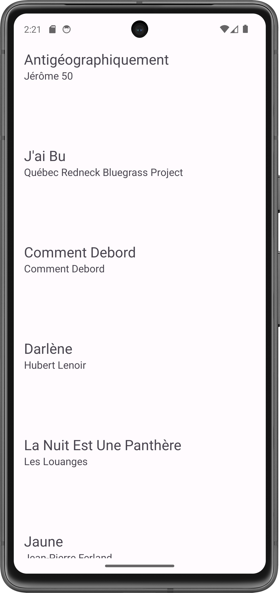
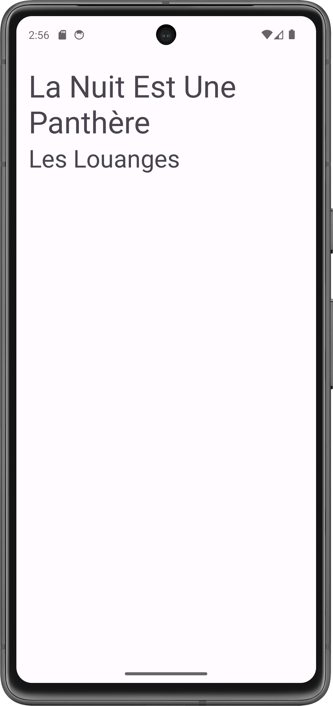
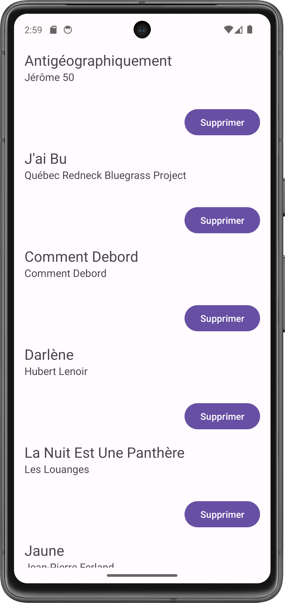
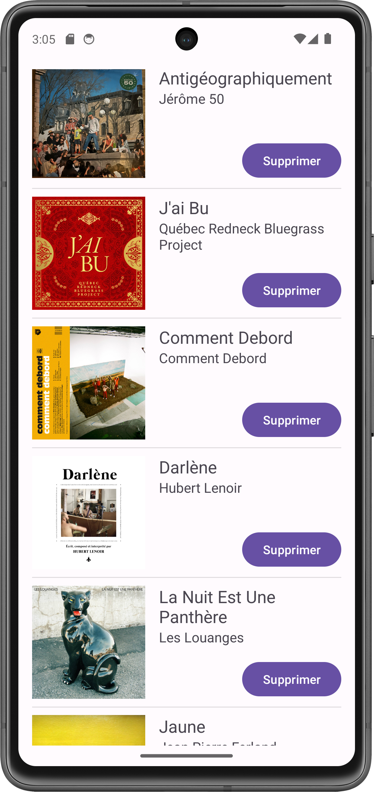
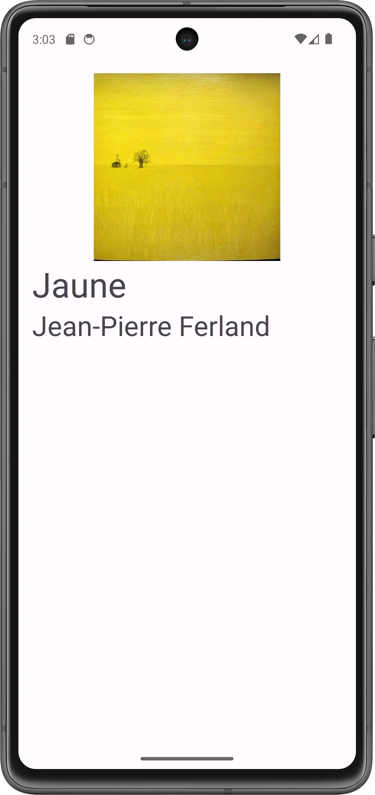
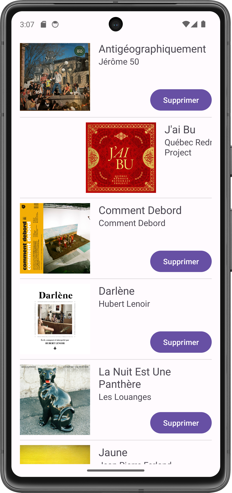

import ReactPlayer from 'react-player'

# Android : listes avec RecyclerView

<Row>

<Column>

TODO:

- produire une recette pour inclure un recyclerview dans une activité existante
  - librairies nécessaires dans build.gradle
  - Ajout du recycler view dans le layout
  - Adapter de base pour juste mettre le toString de l'objet
  - Raffiner le layout
  - Réagir dans l'adapter, obtenir un contexte / naviguer
- une video d'explication du "recycler" dans RecyclerView (plus courte)
  - différence entre create et bind
  - explication avec points d'arret puis ensuite avec trace
- valider la recette en l'appliquant à un projet existant

:::danger Avant la séance (2h)

- Vous devez regarder les vidéos
- Ensuite, commencez les exercices. Arrêtez-vous quand vous avez complété 2 heures.

:::

</Column>

<Column>

:::tip Vidéos

<Video url="https://youtu.be/nkGseYC3QAw" />

[Code après video 1](https://github.com/departement-info-cem/3N5-Prog3/tree/main/code/recyclerview)

<Video url="https://youtu.be/gtHix80YUx0" />

[Code après video 2](https://github.com/departement-info-cem/3N5-Prog3/tree/main/code/RecyclerView-Deboguage)

:::

</Column>

<Column>

:::info À faire pendant la séance

Compléter les exercices de la semaine. Continuer le travail pratique.

:::

</Column>

</Row>

:::note Exercices

##### Avant de commencer 🤔

Les exercices Albums Favoris sont itératifs : à chaque exercices, vous allez commencer à partir de la fin du précédent. Lorsque vous commencez un exercice, nous vous recommandons d'effectuer une copie du dernier projet pour garder une trace de votre avancement. Cela pourrait vous servir lors des examens ou des travaux pratiques!

### Exercice Albums Favoris : Base

<Row>

<Column size="9" >

Vous devez implémenter un RecyclerView simple, où chaque entrée de la liste est une `String` qui représente l'un de vos albums favoris. Chaque entrée de la liste a une hauteur de 150dp.

</Column>
<Column size="3" >


</Column>

</Row>

### Exercice Albums Favoris : Champs d'une classe

<Row>

<Column size="9" >

Chaque entrée de la liste affiche les différents champs d'une classe `Album`.

Voici la classe `Album` :

```kotlin
data class Album(
    val id: Int,
    val name: String,
    val artistName: String,
)
```

</Column>
<Column size="3" >



</Column>

</Row>

### Exercice Albums Favoris : Page de détails

<Row>

<Column size="9" >

Lorsqu'on clique sur un élément de la liste, on doit ouvrir une activitée de détail liée à l'entrée cliquée. La page de détail doit afficher les mêmes champs qui sont affichés dans la liste.

</Column>
<Column size="3" >



</Column>
</Row>

### Exercice Albums Favoris : Supprimer

<Row>

<Column size="9" >

Chaque élément de la liste possède un bouton "Supprimer" qui permet de supprimer l'entrée de la liste.

</Column>
<Column size="3" >



</Column>
</Row>

### (Optionnel) Exercice Albums Favoris : Finition

<Row>

<Column size="6" >

Pour chaque élément de la liste, et dans la page de détails, affichez l'image d'un album à partir d'une URL. Nous vous recommandons d'utiliser la librairie [Picasso](https://square.github.io/picasso/) pour vous aider.

Voici la classe `Album` mise à jour :

```kotlin
data class Album(
    val id: Int,
    val name: String,
    val artistName: String,
    val coverUrl: String,
)
```

Ajoutez un séparateur entre chaque élément de la liste.

</Column>
<Column size="3" >



</Column>
<Column size="3" >



</Column>
</Row>

### (Optionnel Avancé) Exercice Albums Favoris : Supprimer en glissant

<Row>

<Column size="6" >

Faites en sorte qu'on soit capable de supprimer un élément de la liste en le glissant vers la droite ou vers la gauche.

</Column>
<Column size="3" >

On commence à glisser de gauche à droite.



</Column>
<Column size="3" >

On a terminé de glisser, l'item a été supprimé.


</Column>
</Row>

### Exercice Bingo

Vous devez implanter une liste qui sera affichée sur les téléphones des participants d'un jeu de Bingo. Chaque élément de la liste doit avoir :

- Le no de tirage (combien de boules ont été tirées, on commence à 1)
- Le numéro tiré (aléatoire entre 1 et 75)
- La lettre du mot BINGO correspondant au chiffre (B : 1 à 15, I : 16 à 30, N : 31 à 45, G : 46 à 60, O : 61 à 75)

<Row>

<Column size="6">


</Column>

</Row>

### Exercice OrdreAlpha

<Row>

<Column size="6" >

- Vous devez implanter un jeu où une liste de prénoms est classée dans un ordre aléatoire.
- Chaque élément a 2 boutons qui permettent de changer l’ordre dans la liste.
- Le joueur gagne dès que la liste est dans l’ordre alphabétique. Dans ce cas :
  - On affiche un dialogue de félicitations
  - On mélange la liste à nouveau.

</Column>

<Column size="6">


</Column>

</Row>

### Exercice duplicata

Une liste avec les nombres entiers de 1 à 10, chaque fois qu'on appuie sur un item, il se dédouble.

:::
